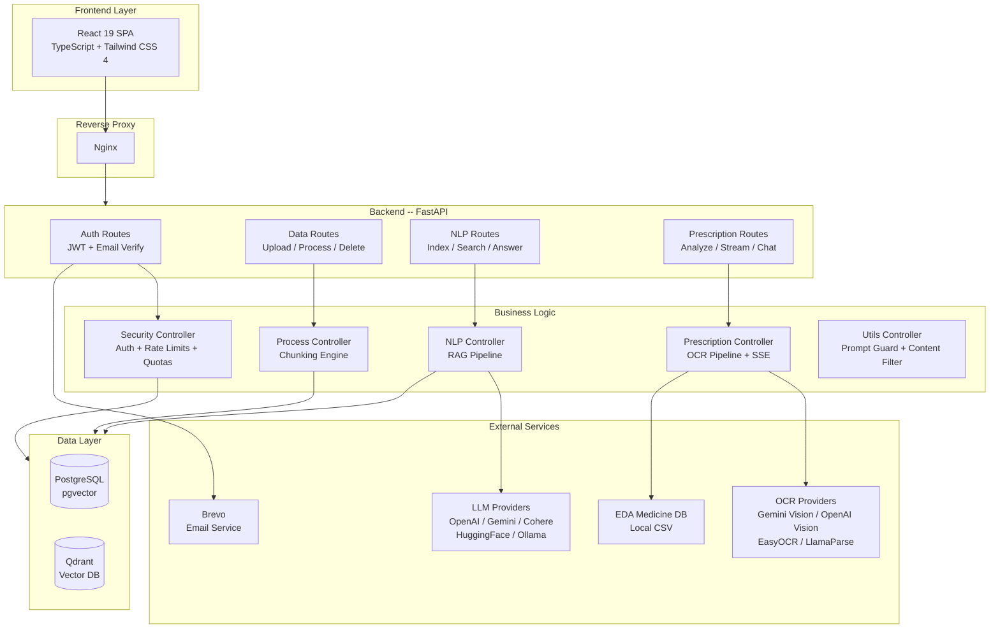

# RxTract

> **AI-Powered Prescription Analyzer & RAG System** -- Upload prescriptions, get instant medicine analysis with real alternatives from the Egyptian Drug Authority (EDA), and ask questions about your documents using Retrieval-Augmented Generation.

---

## Key Features

### Prescription Analysis (OCR to AI)

- **Multi-provider OCR**: Supports Gemini Vision, OpenAI Vision, EasyOCR, and LlamaParse
- **Image preprocessing**: Automatic denoising, binarization, and deskew via OpenCV before OCR
- **Intelligent medicine extraction**: LLM-based extraction with algorithmic fallback
- **Real-time progress**: Server-Sent Events (SSE) stream each pipeline step to the UI
- **EDA medicine matching**: Fuzzy-matches extracted medicines against the Egyptian Drug Authority database (~40,000+ products), suggests real alternatives with pricing, and provides intelligent candidate suggestions for unrecognized medicines
- **Auto-index into RAG**: Each analyzed prescription is automatically indexed so users can ask follow-up questions via chat
- **End-to-end pipeline**: OCR > Extraction > Enrichment > Database Matching > RAG Indexing > Response

### RAG Document Q&A

- **Multi-format ingestion**: PDF, TXT, Markdown, JSON, CSV, DOCX
- **Hybrid search**: Dense vector search + BM25 sparse retrieval with configurable alpha blending
- **Multiple LLM providers**: OpenAI, Google Gemini, Cohere, HuggingFace, and Ollama (local)
- **Multiple vector databases**: PostgreSQL with pgvector or Qdrant
- **Semantic search**: Natural language queries across indexed documents

### Security & Auth

- **JWT authentication**: Secure login/register with token-based access control
- **Email verification**: Brevo (Sendinblue) integration for account verification
- **Prompt injection guard**: Detects and blocks injection attempts in user queries
- **Content filtering**: Output leakage prevention for sensitive data
- **Rate limiting**: Per-user rate limiting via SlowAPI (falls back to per-IP)
- **Daily usage quotas**: Configurable per-user daily limits for queries, uploads, and prescriptions

### Monitoring & Observability

- **Prometheus metrics**: Custom application metrics with auto-instrumented endpoints
- **Health endpoint**: `GET /api/health` for uptime monitoring

---

## Architecture



---

## Getting Started

### Prerequisites

| Tool | Version | Purpose |
|------|---------|---------|
| Python | 3.11+ | Backend runtime |
| Node.js | 18+ | Frontend build |
| pnpm | latest | Frontend package manager |
| Docker | 20+ | Database containers |
| uv | latest | Python dependency management (recommended) |

### Option A: Hybrid Development (Recommended)

Docker runs only the databases. Backend and frontend run locally for fast iteration with hot-reload.

#### 1. Clone the Repository

```bash
git clone https://github.com/mohamedfathi540/rxtract.git
cd rxtract
```

#### 2. Configure Environment

```bash
cd SRC
cp .env.example .env
```

Open `.env` and configure your API keys and preferences:

| Variable | Description | Example |
|----------|-------------|---------|
| `GENRATION_BACKEND` | LLM provider | `OPENAI`, `GEMINI`, `COHERE`, `HUGGINGFACE` |
| `EMBEDDING_BACKEND` | Embedding provider | `GEMINI`, `HUGGINGFACE`, `OPENAI` |
| `OCR_BACKEND` | Prescription OCR provider | `GEMINI`, `OPENAI`, `EASYOCR`, `LLAMAPARSE` |
| `VECTORDB_BACKEND` | Vector database | `PGVECTOR`, `QDRANT` |
| `JWT_SECRET` | Token signing key | Generate with `python3 -c "import secrets; print(secrets.token_hex(32))"` |
| `BREVO_API_KEY` | Email verification API key | Get from Brevo Dashboard |
| `SENDER_EMAIL` | From address for verification emails | `noreply@yourdomain.com` |
| `FRONTEND_URL` | Frontend URL for email links | `http://localhost:5778` |

> **Important:** Change `JWT_SECRET` from the default value before deploying to production.

#### 3. Start Everything with One Command

```bash
cd ..   # Return to project root
bash dev.sh
```

This script will:

1. Start **PostgreSQL (pgvector)** and **Qdrant** via Docker
2. Start **Nginx gateway** via Docker on port `8999` (hybrid reverse proxy)
3. Wait for databases to become healthy
4. Launch the **FastAPI backend** with hot-reload on port `8101`
5. Launch the **Vite frontend** with HMR on port `5877`
6. Tail all logs in your terminal

Optional Cloudflare tunnel:

```bash
export CLOUDFLARE_TUNNEL_TOKEN="<your-tunnel-token>"
bash dev.sh
```

When the token is set and `cloudflared` is installed, the tunnel starts automatically with the dev stack.

**To stop everything:**

```bash
# Press Ctrl+C in the running terminal
# OR run:
bash dev-stop.sh
```

#### 4. Access the Application

| Service | URL |
|---------|-----|
| Application (via Nginx) | `http://localhost:8999` |
| Frontend | `http://localhost:5877` |
| API Docs | `http://localhost:8101/docs` |
| PostgreSQL | `localhost:5536` |
| Qdrant Dashboard | `http://localhost:6337/dashboard` |

---

### Option B: Full Docker Deployment (Production)

Everything runs inside Docker containers with Nginx reverse proxy.

```bash
cd Docker
# Configure environment files in Docker/env/
docker compose up -d --build
```

| Service | Port | URL |
|---------|------|-----|
| Application (via Nginx) | 8999 | `http://localhost:8999` |
| FastAPI (direct) | 8109 | `http://localhost:8109` |
| Frontend (direct) | 5174 | `http://localhost:5174` |
| PostgreSQL | 5536 | `localhost:5536` |
| Qdrant HTTP | 6337 | `http://localhost:6337/dashboard` |
| Qdrant gRPC | 6338 | `localhost:6338` |

See [Docker/README.md](Docker/README.md) for detailed configuration.

---

## API Endpoints

All `/api/v1/*` routes require JWT authentication unless noted.

### Auth (public)

| Method | Endpoint | Description |
|--------|----------|-------------|
| `POST` | `/api/v1/auth/register` | Create account |
| `POST` | `/api/v1/auth/login` | Get JWT token |
| `GET` | `/api/v1/auth/verify?token=...` | Verify email address |
| `POST` | `/api/v1/auth/resend-verification` | Resend verification email |

### Prescription (authenticated)

| Method | Endpoint | Description |
|--------|----------|-------------|
| `POST` | `/api/v1/prescription/analyze` | Analyze prescription (JSON response) |
| `POST` | `/api/v1/prescription/analyze-stream` | Analyze prescription (SSE streaming) |
| `POST` | `/api/v1/prescription/chat` | RAG Q&A scoped to a prescription |

### Data (authenticated)

| Method | Endpoint | Description |
|--------|----------|-------------|
| `POST` | `/api/v1/data/upload/{project_id}` | Upload PDF, TXT, MD, JSON, CSV, or DOCX |
| `POST` | `/api/v1/data/process/{project_id}` | Split into configurable chunks |
| `DELETE` | `/api/v1/data/asset/{project_id}/{file_id}` | Delete a single asset and its chunks/vectors |
| `DELETE` | `/api/v1/data/project/{project_id}/assets` | Delete all assets from a project |

### NLP (authenticated)

| Method | Endpoint | Description |
|--------|----------|-------------|
| `POST` | `/api/v1/nlp/index/push/{project_id}` | Embed and store in vector database |
| `GET` | `/api/v1/nlp/index/info/{project_id}` | Get index statistics |
| `POST` | `/api/v1/nlp/index/search/{project_id}` | Semantic similarity search |
| `POST` | `/api/v1/nlp/index/answer/{project_id}` | RAG-powered Q&A with context |

### System

| Method | Endpoint | Auth | Description |
|--------|----------|------|-------------|
| `GET` | `/api/health` | No | Health check |
| `GET` | `/api/v1/quota/status` | Yes | Current daily usage vs. limits |

---

## System Workflow

### 1. User Registration & Login

```
Register -> Email Verification (Brevo) -> Login -> JWT Token -> Access Protected Routes
```

### 2. Prescription Analysis Pipeline

```
Upload Image -> Preprocess (OpenCV) -> OCR (Vision AI) -> Extract Medicines ->
Match EDA Database -> Index into RAG -> Return Alternatives + project_id
```

Each step streams real-time progress via SSE:

| Step | Description |
|------|-------------|
| Preprocessing | Advanced image enhancement via OpenCV (denoising, binarization, deskew) |
| OCR | Extracts raw text using the configured vision provider |
| Extraction | LLM identifies medicine names, dosages, and forms (with algorithmic fallback) |
| Enrichment | Cross-references extracted medicines with the EDA database (~40,000+ products). Evaluates alternatives and provides candidate suggestions ("Did you mean?") for unrecognized or ambiguous medicines. |
| Indexing | Auto-indexes results into a new RAG project for follow-up chat |
| Response | Returns structured results with real alternatives and pricing |

### 3. RAG Document Pipeline

```
Upload Document -> Process (Chunk) -> Generate Embeddings -> Index in Vector DB -> Query
```

### 4. Medicine Database Update

Update the local EDA medicine database:

```bash
uv run python3 SRC/scripts/scrape_eda.py
```

1. Solve the CAPTCHA shown in `captcha.jpg`
2. Results saved to `SRC/Assets/Files/eda_medicines.csv`

---

## Project Structure

```
rxtract/
├── SRC/                            # Backend -- FastAPI Application
│   ├── main.py                     # App entry point, middleware, router setup
│   ├── Routes/                     # API endpoint definitions
│   │   ├── Auth.py                 # Register, login, email verification, resend
│   │   ├── Data.py                 # File upload, processing, asset deletion
│   │   ├── NLP.py                  # Vector indexing, search, RAG Q&A
│   │   ├── Prescription.py         # OCR analysis (JSON + SSE), prescription chat
│   │   └── Schemes/               # Pydantic request/response schemas
│   ├── Controllers/                # Business logic layer
│   │   ├── NLPController.py        # RAG pipeline + hybrid search
│   │   ├── PrescriptionController.py  # OCR pipeline + medicine matching
│   │   ├── ProcessController.py    # Document chunking engine
│   │   ├── SecurityController.py   # JWT auth, rate limiting, quotas, email
│   │   ├── UtilsController.py      # Prompt guard, content filter, language detect
│   │   ├── DataController.py       # Data/asset management logic
│   │   ├── BaseController.py       # Shared controller utilities
│   │   └── ProjectController.py    # Project management logic
│   ├── Stores/                     # External service integrations
│   │   ├── LLM/                    # LLM providers (OpenAI, Gemini, Cohere, HuggingFace)
│   │   ├── OCR/                    # OCR providers (Gemini Vision, OpenAI Vision, EasyOCR, LlamaParse)
│   │   ├── VectorDB/              # Vector DB providers (pgvector, Qdrant)
│   │   └── Sparse/                # BM25 sparse retrieval
│   ├── Utils/                      # Utilities
│   │   ├── MedicineMatcher.py      # Fuzzy medicine matching against EDA DB
│   │   ├── NLPPreprocess.py        # Text preprocessing utilities
│   │   ├── sse_helpers.py          # SSE event formatting helpers
│   │   └── metrics.py             # Prometheus metrics setup
│   ├── Models/                     # SQLAlchemy models + Alembic migrations
│   ├── Helpers/                    # Configuration
│   ├── scripts/                    # Utility scripts
│   │   ├── scrape_eda.py           # EDA medicine database scraper
│   │   └── process_embeddings.py   # Batch embedding processor
│   └── .env.example                # Environment template
│
├── frontend/                       # Frontend -- React 19 SPA
│   ├── src/
│   │   ├── pages/                  # Application pages
│   │   │   ├── PrescriptionPage    # OCR analysis with progress streaming
│   │   │   ├── ChatPage            # RAG Q&A interface
│   │   │   ├── SearchPage          # Semantic search
│   │   │   ├── LoginPage           # Authentication
│   │   │   ├── RegisterPage        # User registration
│   │   │   └── VerifyEmailPage     # Email verification
│   │   ├── components/             # Reusable UI components
│   │   │   ├── ui/                 # Primitives (Button, Logo, QuotaPanel, ToastContainer)
│   │   │   └── layout/            # App layout (Sidebar, MainLayout)
│   │   ├── stores/                 # Zustand state (auth, settings, quota, toast)
│   │   ├── api/                    # API client layer (Axios + type definitions)
│   │   └── utils/                  # Shared utility functions
│   └── index.html                  # App shell
│
├── Docker/                         # Docker deployment
│   ├── docker-compose.yml          # Full production stack
│   ├── docker-compose.dev.yml      # Dev-only (databases)
│   ├── Nginx/                      # Reverse proxy config
│   ├── Prometheus/                 # Metrics scraping config
│   └── env/                        # Container environment files
│
├── dev.sh                          # One-command dev environment launcher
├── dev-stop.sh                     # Graceful shutdown script
├── API.md                          # Complete API reference
└── project_workflow.md             # System workflow diagrams
```

---

## Configuration Reference

### LLM Providers

| Provider | Backend Value | API Key Variable | Notes |
|----------|---------------|------------------|-------|
| OpenAI | `OPENAI` | `OPENAI_API_KEY` | Also supports OpenRouter via `OPENAI_BASE_URL` |
| Google Gemini | `GEMINI` | `GEMINI_API_KEY` | Recommended for OCR |
| Cohere | `COHERE` | `COHERE_API_KEY` | Supports Command R+ |
| HuggingFace | `HUGGINGFACE` | `HUGGINGFACE_API_KEY` | Free tier available |
| Ollama | `OPENAI` | Set `OPENAI_API_KEY=ollama` | Local models via custom `OPENAI_BASE_URL` |

### OCR Providers

| Provider | Backend Value | Requires | Best For |
|----------|---------------|----------|----------|
| Google Gemini Vision | `GEMINI` | `GEMINI_API_KEY` | Handwritten prescriptions |
| OpenAI Vision | `OPENAI` | `OPENAI_API_KEY` | General document OCR |
| EasyOCR | `EASYOCR` | Nothing (local) | Offline/privacy-first |
| LlamaParse | `LLAMAPARSE` | `LLAMA_CLOUD_API_KEY` | Structured documents |

### Vector Database Options

| Database | Backend Value | Dev Port | Prod Port | Notes |
|----------|---------------|----------|-----------|-------|
| PostgreSQL + pgvector | `PGVECTOR` | 5433 | 5536 | Recommended, uses existing PostgreSQL |
| Qdrant | `QDRANT` | 6333 | 6337 | High-performance, standalone vector DB |

### Rate Limits & Quotas

| Variable | Default | Description |
|----------|---------|-------------|
| `RATE_LIMIT_AUTH` | `10/minute` | Auth endpoints (per-IP) |
| `RATE_LIMIT_UPLOAD` | `20/minute` | Upload/indexing endpoints |
| `RATE_LIMIT_QUERY` | `30/minute` | Search/answer endpoints |
| `RATE_LIMIT_PRESCRIPTION` | `10/minute` | Prescription analysis endpoints |
| `QUOTA_DAILY_QUERIES` | `200` | Max queries per user per day |
| `QUOTA_DAILY_PRESCRIPTIONS` | `30` | Max prescription analyses per user per day |
| `QUOTA_DAILY_UPLOADS` | `50` | Max uploads per user per day |

### Hybrid Search

| Variable | Default | Description |
|----------|---------|-------------|
| `HYBRID_SEARCH_ENABLED` | `true` | Enable dense + BM25 hybrid search |
| `HYBRID_SEARCH_ALPHA` | `0.6` | Blend ratio (0 = only BM25, 1 = only dense) |

---

## Self-Hosting Guide

Turn any computer into a professional RxTract server using Cloudflare Tunnel.

### Phase 1: Hardware & OS

- **Hardware**: Any computer with 4GB+ RAM (old laptop recommended for built-in UPS)
- **Connection**: Ethernet cable for stability
- **OS**: Ubuntu Server 24.04 LTS (enable OpenSSH during installation)

### Phase 2: Install & Deploy

```bash
# SSH into your server
ssh your_username@local_ip

# Install Docker
sudo apt-get update
sudo apt-get install ca-certificates curl
sudo install -m 0755 -d /etc/apt/keyrings
sudo curl -fsSL https://download.docker.com/linux/ubuntu/gpg -o /etc/apt/keyrings/docker.asc
sudo chmod a+r /etc/apt/keyrings/docker.asc

echo \
  "deb [arch=$(dpkg --print-architecture) signed-by=/etc/apt/keyrings/docker.asc] https://download.docker.com/linux/ubuntu \
  $(. /etc/os-release && echo "$VERSION_CODENAME") stable" | \
  sudo tee /etc/apt/sources.list.d/docker.list > /dev/null
sudo apt-get update
sudo apt-get install docker-ce docker-ce-cli containerd.io docker-buildx-plugin docker-compose-plugin

# Clone and start
git clone https://github.com/mohamedfathi540/rxtract.git
cd rxtract/Docker
# Configure your .env files in Docker/env/
docker compose up -d --build
```

### Phase 3: Expose via Cloudflare Tunnel

```bash
# Install cloudflared
curl -L --output cloudflared.deb https://github.com/cloudflare/cloudflared/releases/latest/download/cloudflared-linux-amd64.deb
sudo dpkg -i cloudflared.deb

# Quick test (temporary URL)
cloudflared tunnel --url http://localhost:8999

# For permanent setup:
# 1. Create Cloudflare account -> Zero Trust -> Tunnels
# 2. Public Hostname: rxtract.yourdomain.com -> HTTP -> localhost:8999
```

### Troubleshooting

| Issue | Solution |
|-------|----------|
| Cannot connect to Docker daemon | `docker context use default` or `sudo systemctl start docker` |
| Server restarts after power outage | Configure BIOS: Power On After Power Failure |

---

## Additional Documentation

- [API Reference](API.md) -- Complete REST API documentation
- [System Workflow](project_workflow.md) -- Detailed pipeline diagrams
- [Docker Guide](Docker/README.md) -- Container configuration and management
- [Frontend Guide](frontend/README.md) -- React SPA setup and structure
